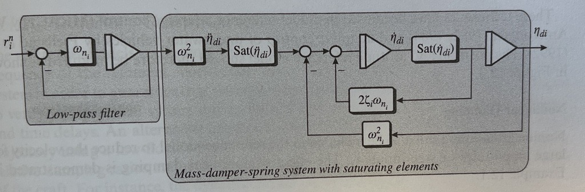

# reference_model_siso

Implementation of a single input, single output (SISO) version of a 2nd order mass-spring-damper model with saturation, and a 3rd order model where a 1st order low-pass filter is casaded with the 2nd order model.

## Dependencies
n/a

## References
1. Fossen, T. I. (2021). *Handbook of Marine Craft Hydrodynamics and Motion Control*, 2nd edition, John Wiley & Sons. Ltd., Chichester, UK. ISBN 978-1119575054.
